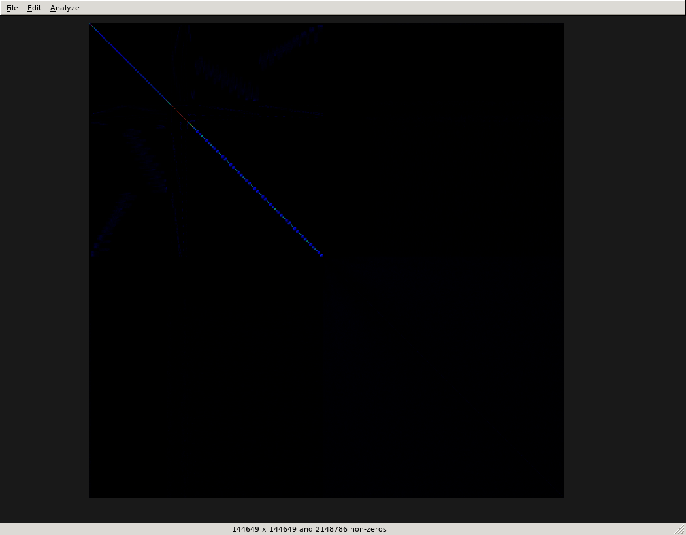

MatrixInspector
===============

A tool for viewing and manipulating sparse matrices.




Build Dependencies 
------------------

- CMake
- C++ compiler support C++11
- wxWidgets 3 (development headers)


Runtime Dependencies
--------------------

- wxWidgets 3


Packages
--------

Built using <a href="https://github.com/BytePackager/packagecore">PackageCore</a>.

See <a href="https://github.com/dlasalle/matrixinspector/releases">releases</a>
for Arch, Fedora, and Ubuntu packages.


Building
--------
```
./configure && make
```


Installation
------------
```
make install
```


Unit Tests
----------

<a href="https://travis-ci.org/dlasalle/matrixinspector">
  
</a>
