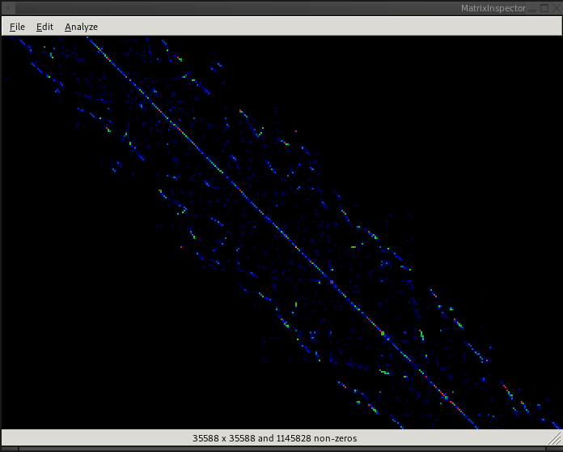

# Getting Started

## Opening a Matrix

To open a matrix or graph, select `File`->`Open...` from the top menu.
You can also open a matrix from the command line when running
`matrixinspector`:

```bash
$ matrixinspector mymatrix.mtx
```

## Viewing a Matrix

To zoom in on the matrix, use the scroll wheel.
You can click and drag on the matrix to move it around.
Black pixels represent areas of the matrix where there are no non-zeros.
Pixels that are blue through white represent the presence of non-zeros, with
dark blue being the lowest density and white being the highest density.




## Saving a Matrix

To save the currently loaded matrix or graph, select `File`->`Save...` (or
`File`->`Save As...`).
