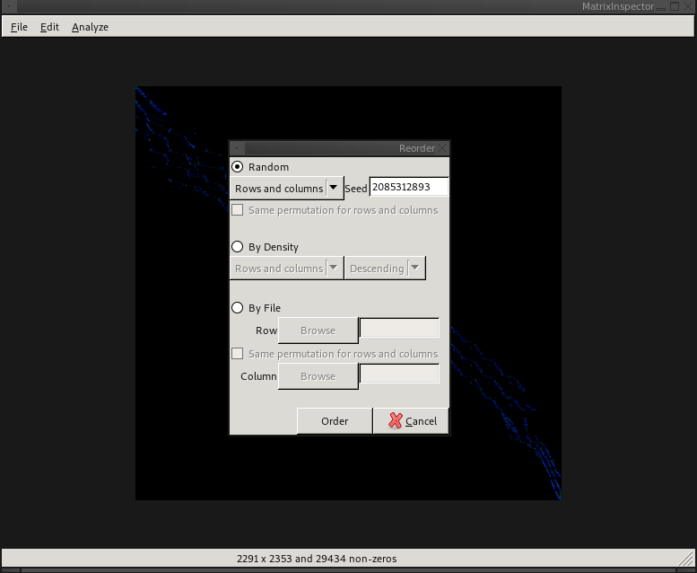
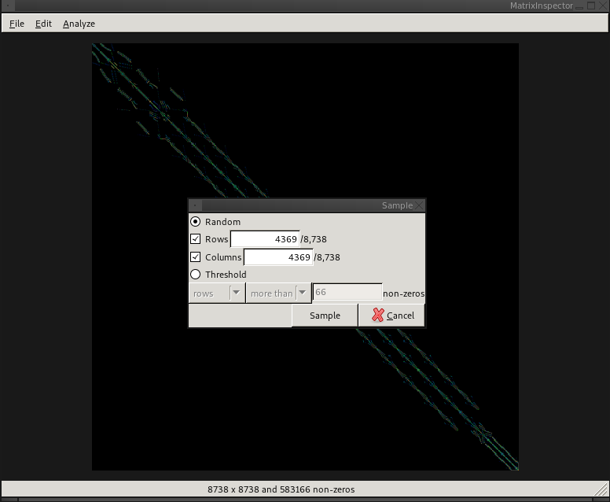

# The Edit Menu

The `Edit` menu provides methods for manipulating/editing matrices. These
changes can then be saved.

## Transposing a Matrix

Transposition is a simple operation, where the rows and columns are switched.

## Reordering a Matrix

To reorder a matrix once its been opened, select `Edit->Reorder` from the top
menu. This opens the Reorder dialog.



### Random

Random reordering can be used scramble the matrix. The `Seed` is the unsigned
integer used as the random seed, and can be used reproduce random orderings.
The check box `Same permutation for rows and columns` makes it such that rows
and columns are reordered in-sync (a symmetric matrix will remain symmetric
even after the reordering).

### Density

Density can be used to place rows/columns with high numbers of non-zeros at the
start or beginning of the matrix. You can choose to reorder just the rows,
just the columns, or reorder both in-sync (a symmetric matrix will remain
symmetric).

### By File

You can reorder a matrix based on file containing a permutation vector.
This can be useful when you have an external program generate a Nested
Dissection or RCM reordering.
A
valid permutation file for reversing the rows of a five row matrix would look
like:

```
4
3
2
1
0
```

Where each line of the file corresponds to key of the row/column of the matrix.
This means each line can be the actual permutation destination as in this case,
but it can also be any non-negative integer value, where rows with lower key
values will be ordered first. So to place the first and third rows first, and
the second, fourth, and fifth rows last, the following file could be used.

```
2
1
2
1
1
```


## Sampling a Matrix

To take a sample of a matrix, select `Edit`->`Sample` from the top menu. This
opens the 'Sample' dialog.




### Random

When using the 'Random' sampling on square matrices, checking both 'Rows' and
'Columns' will produce a symmetric sampling. That is, if row `i` is selected,
then column `i` will also be selected. To create an asymmetric random sampling
of a square matrix, take a sampling of rows and columns in two separate steps.


### Threshold

Selecting rows or columns using a density threshold can be used to remove
entries from your dataset with too many or too few non-zeros. This will always
be a non-symmetric modification to the matrix.
