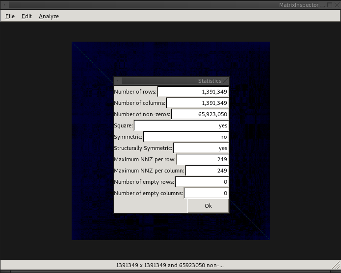

# The Analyze Menu

The `Analyze` menu provides methods for gaining insight into the matrix.

## Matrix Statistics

The statistics dialog can be brought up by selecting `Analyze`->`Statistics`
from the top menu.

This provides information about the matrix, such as size, density, and
symmetry.
